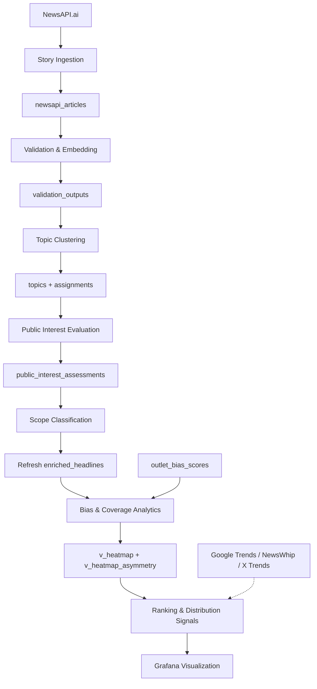

# Architecture Map

High-level architecture of the MediaDotGames platform.

Major subsystems:

1. Story Ingestion (NewsAPI.ai → `newsapi_articles`)
2. Story Storage (RDS PostgreSQL 15 + pgvector)
3. Validation & Embedding (text normalization, body quality, category assignment, embedding generation)
4. Topic Clustering (medoid-based assign-or-create with 168h temporal window + entity veto)
5. Public Interest Evaluation (LLM 4-criteria gate rule)
6. Scope Classification (IN_SCOPE / OUT_OF_SCOPE)
7. Bias & Coverage Analytics (outlet bias scores, heatmap views, asymmetry detection)
8. Ranking & Distribution Signals (composite ranking from media production + public attention + strategic importance signals) — planned
9. Visualization (Grafana dashboards)

