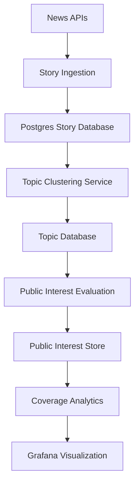

# Architecture Map

High-level architecture of the MediaDotGames platform.

Major subsystems:

1. Story Ingestion
2. Story Storage
3. Topic Clustering
4. Public Interest Evaluation
5. Coverage Analytics
6. Visualization

Mermaid diagram:

